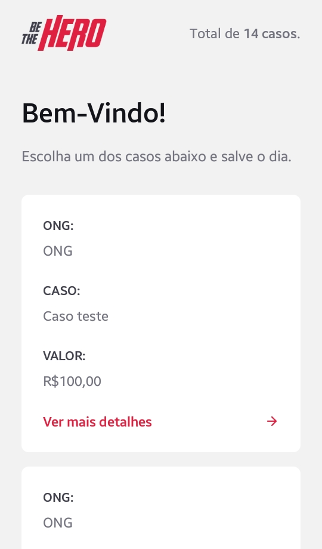
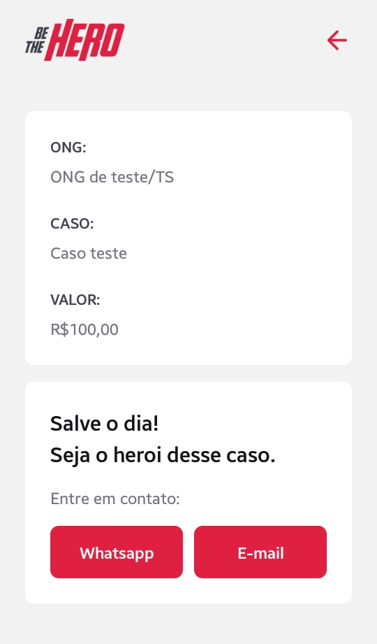

<h1 align="center">


[](https://github.com/mateusfg7/BeTheHero-Backend)
[](https://github.com/mateusfg7/BeTheHero-Frontend)
[](https://github.com/mateusfg7/BeTheHero-Mobile)

</h1>

<h3 align="center">

Be The Hero (Seja um herói) é uma aplicação que conecta pessoas que tem vontade de ajudar ONGS doando um valor para tratar algum caso específico.

</h3>
<h4 align="center">

_Versão mobile da aplicação, feita na **Semana OmniStack 11** da **Rocketseat**_

_(23/03/20 a 27/03/20)_

[TO-DO + Anotações](https://github.com/users/mateusfg7/projects/4)

© [Rocketseat](https://rocketseat.com.br/)

Instrutor: [Diego Fernandes](https://github.com/diego3g)
</h4>

---

> Template figma (.fig) do projeto -> [doc/Be_The_Hero_OmniStack_11.fig](doc/Be_The_Hero_OmniStack_11.fig)

**App feito com [React-Native](https://reactnative.dev/)**

## Instalar dependências
```bash
npm install
```
## Iniciar ambiente de desenvolvimento
```bash
npm start
```


## Estrutura
- `assets/` -> icone e splash screen
- `App.js` -> arquivo principal
- `app.json` -> arquivo de configuração do expo
- `src/assets/` -> imagens do projeto
- `src/pages/` -> páginas do projeto
- `src/pages/Incidents/` -> página de listagem de casos
- `src/pages/Detail` -> página de detalhes de um caso
- `src/routes.js` -> arquivo de configuração de navegação
- `src/services/api.js` -> chamada a api do back-end. Adicione o endereço do servidor back-end da aplicação à [linha 4]() `baseURL: '',`
```javascript
import axios from 'axios';

const api = axios.create({
  baseURL: 'AQUI_VAI_O_ENDEREÇO_DO_SERVIDOR',
});

export default api;
```
_ex:_
```javascript
import axios from 'axios';

const api = axios.create({
  baseURL: 'http://192.168.100.5:3333',
});

export default api;
```

<h3 align="center">

## Screenshots

> _página de listagem de casos_



> _página de detalhes de um caso_


</h3>
